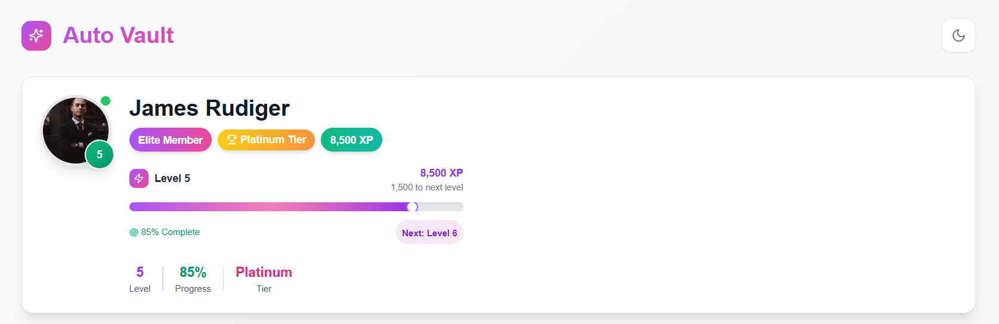
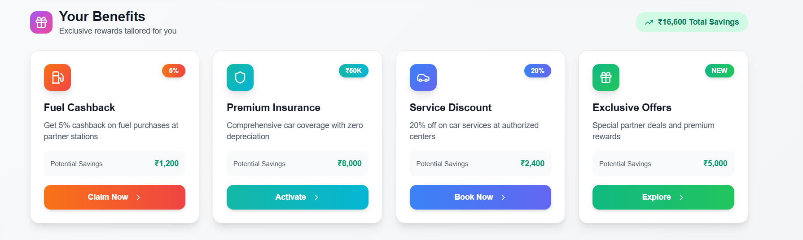
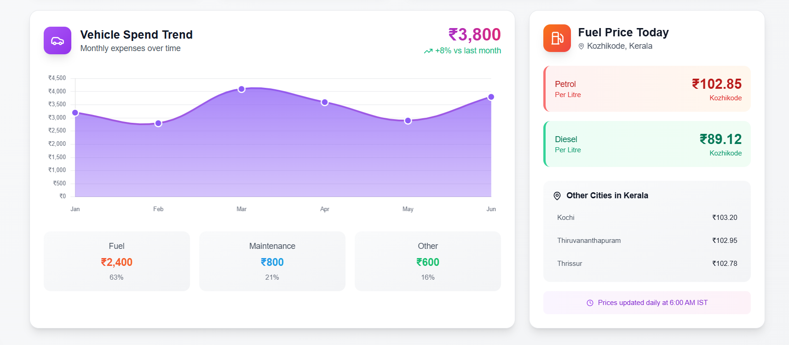

# 🚗 Auto Vault – CRED Garage Inspired Dashboard

A modern, responsive dashboard UI inspired by **CRED Garage**, built with **Next.js**, **Tailwind CSS**, and **Framer Motion**. Auto Vault helps users manage their vehicle-related rewards, profile stats, and exclusive benefits — all with elegant design and fluid interactions.

## 📸 Preview & Demo

**🎬 Video Walkthrough**: [Watch on Loom](YOUR_LOOM_LINK_HERE) 📹  
**🌐 Live Demo**: [Visit on Vercel](https://auto-vault-kz3t4a0r1-ludiadmuhameds-projects.vercel.app/) 🚀

---

## 🔧 Tech Stack

| Technology        | Description                                      |
|------------------|--------------------------------------------------|
| [Next.js](https://nextjs.org/)        | React Framework for SSR, routing, and performance |
| [Tailwind CSS](https://tailwindcss.com/) | Utility-first CSS framework                   |
| [Framer Motion](https://www.framer.com/motion/) | Smooth animations and transitions             |

---

## 📦 Features Overview

### 👤 User Profile

- **Avatar Display**: Circular profile image with gradient border and online status indicator
- **Level System**: Dynamic level badge with current level display
- **Progress Tracking**: Animated XP progress bar with completion percentage
- **Tier Recognition**: Color-coded tier badges (Bronze, Silver, Gold, etc.)
- **Achievement Stats**: Level, progress percentage, and tier display with visual separators
- **Responsive Design**: Adapts seamlessly from mobile to desktop layouts

### 🎮 Interactive Progress System

- **Animated Progress Bar**: Smooth fill animation with gradient colors
- **XP Tracking**: Real-time experience points with formatting (e.g., "12,450 XP")
- **Level Progression**: "XP to next level" indicator with motivational design
- **Progress Indicator**: Animated progress dot that moves along the progress bar
- **Completion Percentage**: Dynamic percentage display with target icon

### 🎁 Premium Benefits Hub

- **Grid Layout**: Responsive card grid (1-4 columns based on screen size)
- **Benefit Cards**: Each card features:
  - Gradient-themed icons with hover animations
  - Title and detailed description
  - Potential savings calculator
  - Interactive CTA buttons with animated chevron
- **Hover Effects**: 3D card lift animations and gradient overlays
- **Total Savings**: Prominent display of accumulated savings (₹16,600 Total Savings)
- **Category Icons**: Gift, trending, and benefit-specific iconography

### 🎯 Interactive Animations

- **Staggered Animations**: Sequential card entrance with spring physics
- **Hover Interactions**: Scale, rotate, and lift effects on interactive elements
- **Loading States**: Skeleton placeholders with pulse animations
- **Micro-interactions**: Button press feedback and icon rotations
- **Page Transitions**: Smooth fade-in and slide-up animations

### 🌓 Dark/Light Mode Toggle

- Toggle button with animation
- Preference stored in `localStorage`
- Seamless theme transitions across all components

### ⏳ Advanced Loading States

- **Profile Skeleton**: Animated loading placeholders for avatar and user info
- **Progressive Loading**: Smooth transition from skeleton to actual content
- **Pulse Animations**: Subtle loading indicators throughout the interface

### 📱 Responsive Design

- **Breakpoint Optimization**: Tailored layouts for sm, md, lg, and xl screens
- **Flexible Typography**: Responsive text sizing and spacing

---

## 🎥 Project Walkthrough

For a detailed overview of the project's features, animations, and responsive design, check out the **Loom walkthrough video** linked above. The video covers:

- 🎨 UI/UX design inspiration from CRED Garage
- ⚡ Interactive animations and micro-interactions
- 📱 Responsive behavior across different screen sizes
- 🔧 Technical implementation highlights
- 🎮 User experience flow and navigation
